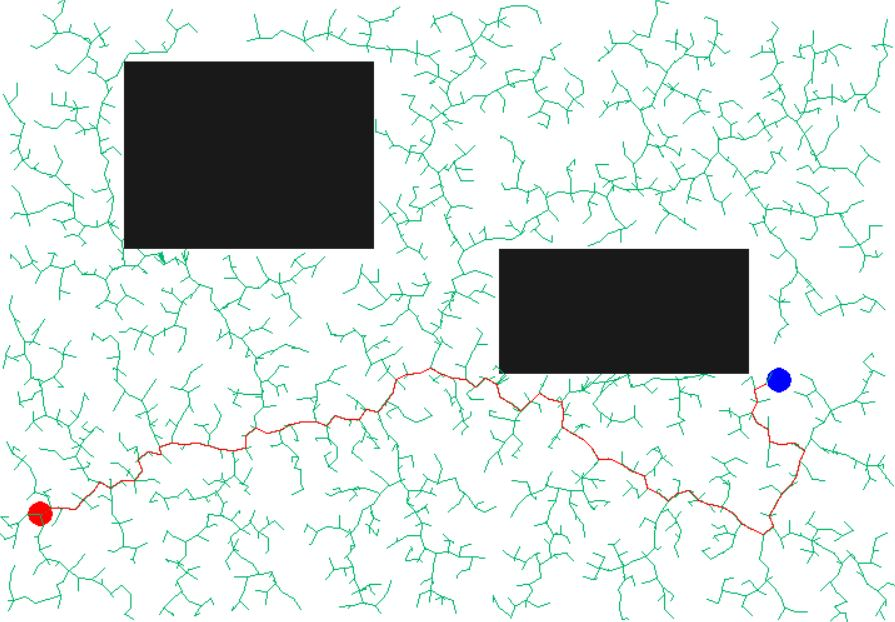
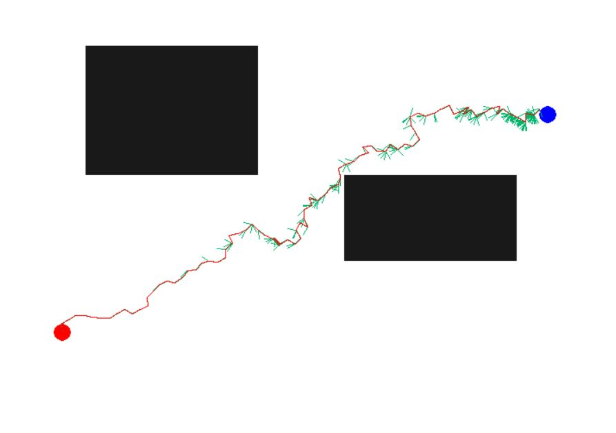

# 3D_Path_Planning
### is an AI project for 3D Path Planning which involves pruning with constant satisfaction.
3D path planning is required in various applications such as robotics, self-driving cars,
protein folding, games etc. It ensures to and a trajectory from the initial point to the
destination, subject to rules of motion and any other constraints, such as collision avoid-
ance, balance and joint limits. 
Algorithms like Dijkstra, A* can be used but they are quite expensive to compute for
large clustered space Random sampling based planning algorithm like RRT can solve
motion planning problem while also taking the differential constraint into consideration.
But the paths so produced are jagged, with several unnecessary branches. They need
to be pruned and smoothed. An approach could be to fit a spline over the points which
would produce a smooth path. 
 
<b> Developers: </b> Kushagra Khare, Rachit Jain  
<b> Mentor: </b> Prof. Srisha Rao, IIIT-B  
<b> Project Duration: </b> Aug '18 - Nov '18  

## Goal
In this project, we aim to provide an algorithm for 3D Path Planning. We will implement a 
RRT-A* based 3D Path Planning algorithm. The algorithm would include path pruning with 
constraint satisfaction and account for non-holonomic constraints. We will go ahead with 
Manhattan based RRT-A* in the initial stages but will also try to find an optimized distance 
metric function using Voronoi bias property for the algorithm.

## Technologies used:
<ul>
<li>PyGame & POGL</li>
<li>Scikit, NumPy, Scipy</li>
</ul>

## Milestones
### Week 1
<ul>
<li>Implemented a basic Random-exploring Random Tree algorithm using PyGame.</li>
<li>Read about various types of RRTs and implemented RRT-A* vartion. Compared its pros and 
cons with the basic algorithm</li>
</ul>

## Future works:
<ul>
<li>Obstacle collision detection can be parallelized by using CUDA which will make computation a lot faster and applicable in real life scenarios.
</ul> 
